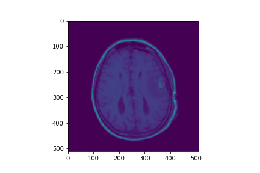
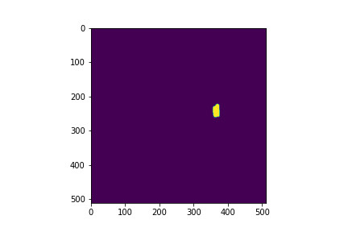

# Replicating and Generating Another Tumor in An Image of the Brain

## Installation
Open terminal in this directory and run either:
1. pip install the module itself
```
pip install .
```
2. setup.py (same as 1)
```
python setup.py install
```
3. docker-compose to set up an environment with module installed
```
docker-compose up -d
```

## Getting Started

You would need two images before using this package:

1. Original Image



2. Tumor Mask



```
from tureplicator.replicate import TumorReplicator

r = TumorReplicator(tumor_box_size=50, skull_threshold=190, outer_erosion=50, inner_erosion=5,
                   spawn_tol=0.6, overlap_range=(0.4,0.5), dist_transform_mask_size=5, dist_transform_scalar=1.5,
                   seed=42)
result = r.generate(tumor, mask)
```

After running the generate() method, you should be able to derive results similar to this:


## Example Notebooks

Example notebooks provided will demonstrate derivation of idea and how to use the package.

## Jupyter Notebook Server
To set up a notebook server, follow step 3 of **Installation** and assuming default settings are applied, head to *http://localhost:8889/tree* to view existing or create new notebooks to perform experiments with the module. Token would be password by default.